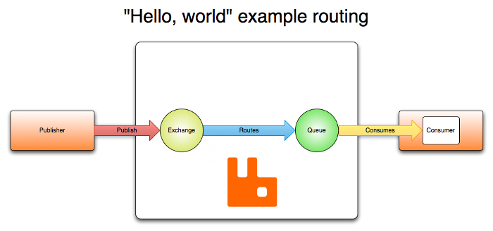

## O que é RabbitMQ?
RabbitMQ é um servidor de mensageria de código aberto (open source) desenvolvido em Erlang, implementado para suportar mensagens em um protocolo denominado Advanced Message Queuing Protocol (AMQP). Ele possibilita lidar com o tráfego de mensagens de forma rápida e confiável, além de ser compatível com diversas linguagens de programação, possuir interface de administração nativa e ser multiplataforma.



## Principais tipos de exchanges

### Direct
* Seu comportamento é de encaminhar mensagens que possuam exatamente a mesma rota das filas associadas a este exchange;
* Exemplo: uma fila é associada a um exchange com a rota estoque. Quando uma nova mensagem com a rota estoque chega no direct exchange ele a encaminha para a fila estoque;
### Topic
* Seu comportamento é enviar as mensagens de acordo com a rota definida na mensagem e o padrão definido na associação da fila ao exchange;
### Fanout
* Esta exchange ignora a rota, seu comportamento é enviar todas as mensagens para todas as filas que estão associadas a ele;


### Docker

* Utilizar o docker compose o arquivo está na raiz do projeto em docker/docker-compose.yml
  * ```docker-compose up -d```
* Ou executar o comando:
    * ```docker run -d -p 5672:5672 -p 15672:15672 --name rabbitmq rabbitmq:3.11-management```

